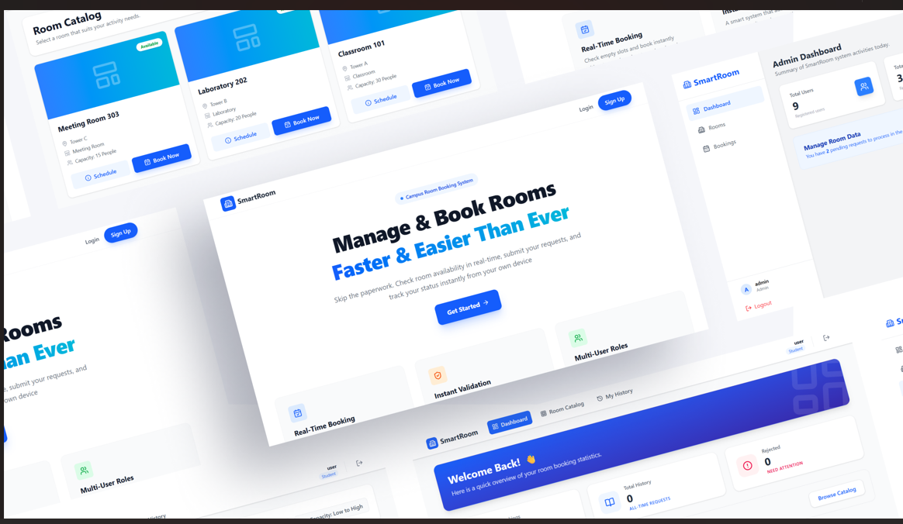

# 🏢 SmartRoom - University Room Booking System (Frontend)

<p align="center">
  
</p>

SmartRoom is a modern web-based application designed to streamline the room reservation process at universities. The application provides separate, dedicated interfaces for **Students** (Borrowers) and **Administrators** (Managers).

Built with **React + TypeScript + Vite** for maximum performance and **Tailwind CSS** for a responsive and elegant user experience.

---

## 🚀 Tech Stack

* **Framework:** [React 18](https://reactjs.org/) + [Vite](https://vitejs.dev/)
* **Language:** TypeScript
* **Styling:** Tailwind CSS
* **Icons:** Lucide React
* **State & Fetching:** Axios, React Hooks
* **Notifications:** React Hot Toast
* **Routing:** React Router DOM v6

---

## ✨ Key Features

### 👨‍🎓 Student (User)
1.  **Statistics Dashboard:** View real-time summaries of active bookings and reservation history.
2.  **Interactive Room Catalog:**
    * **Search:** Find rooms by name.
    * **Filter:** Narrow down by room type.
    * **Sort:** Organize by capacity.
3.  **Room Schedule:** Check room availability schedules to prevent time conflicts (Start Time - End Time).
4.  **Booking Request:** Easily submit room reservation requests.

### 👮 Administrator (Admin)
1.  **Admin Dashboard:** High-level summary of total users, rooms, and pending booking requests.
2.  **Room Management:** Full CRUD operations (Create, Read, Update, Delete) for room data.
3.  **Audit Logs:** Track activity history ("Who approved?", "When was it created?").
4.  **Booking Management:**
    * **Approval Workflow:** Approve or Reject reservation requests.
    * **Delete:** Permanently remove invalid or redundant booking records.
    * **Search & Filter:** Find bookings by user or status.

---

## 🛠️ Installation & Getting Started

Ensure you have **Node.js** installed (v16 or higher).

1.  **Clone the Repository**
    ```bash
    git clone [https://github.com/username/SmartRoom.Web.git](https://github.com/username/SmartRoom.Web.git)
    cd SmartRoom.Web
    ```

2.  **Install Dependencies**
    ```bash
    npm install
    ```

3.  **Environment Configuration**
    Create a `.env` file in the root directory and set your Backend API URL:
    ```env
    VITE_API_BASE_URL=http://localhost:5000/api
    ```

4.  **Run the Application**
    ```bash
    npm run dev
    ```
    Access the app in your browser at: `http://localhost:5173`

---

## 📂 Folder Structure


```text
src/
├── api/             # Axios configuration & endpoint definitions
├── assets/          # Images & static files
├── components/      # Reusable components (Modals, Buttons, Inputs)
├── context/         # Auth & global state management
├── layouts/         # Layout wrappers (AdminLayout, StudentLayout)
├── pages/           # Application views
│   ├── admin/       # Admin-specific pages
│   ├── auth/        # Login and Register pages
│   └── student/     # Student-specific pages
├── types/           # TypeScript Type/Interface definitions
└── App.tsx          # Main Routing & App Entry

## 📄 License

This project is licensed under the MIT License.  
Free to use and modify for educational purposes.

---

## ✍️ Author

Muhammad Far'An
Frontend Developer  
GitHub: https://github.com/faranaan